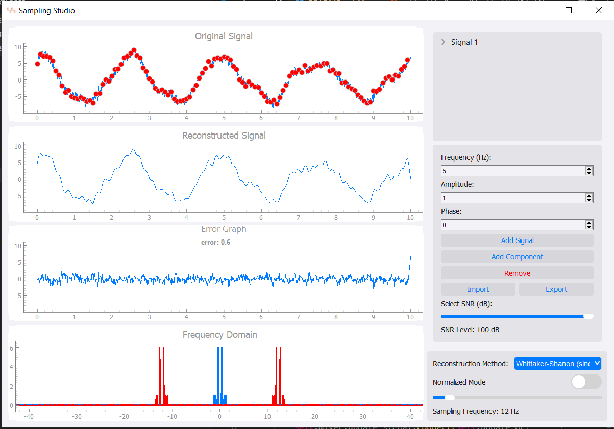

# Sampling Studio

## Overview
Sampling Studio is a desktop application designed to demonstrate the concepts of signal sampling and recovery. This project emphasizes the importance of the Nyquist rate, providing users with tools to visualize and interact with signals through sampling, recovery, noise addition, and frequency analysis.



## Features
### 1. Sample & Recover
- **Load Signal:** Users can load a signal of approximately 1000 points.
- **Sampling Frequency:** Choose sampling frequencies in normalized or actual terms (e.g., 0×fmax to 4×fmax).
- **Visualize Results:**
  - Original signal with sampled points.
  - Reconstructed signal using the Whittaker–Shannon interpolation formula.
  - Difference between the original and reconstructed signals.
  - Frequency domain to inspect aliasing effects.

### 2. Load & Compose
- **Load from File:** Import signals directly from a file.
- **Signal Mixer/Composer:**
  - Add sinusoidal signals with customizable frequencies and magnitudes.
  - Remove components dynamically.
  - Visualize the composed signal in real-time.

### 3. Additive Noise
- **Noise Addition:** Add noise with a customizable Signal-to-Noise Ratio (SNR).
- **Frequency Dependency:** Analyze how noise affects signals of different frequencies.

### 4. Real-time Updates
- All changes to sampling, recovery, and noise parameters are applied immediately without requiring manual refreshes.

### 5. Reconstruction Methods
- **Whittaker–Shannon Interpolation** (default).
- Additional reconstruction methods, selectable via a combobox.
- Compare and analyze the pros and cons of each method.

### 6. Resizable Interface
- The application’s UI adapts smoothly to window resizing, ensuring graphs and controls remain user-friendly.

### 7. Testing Scenarios
- Predefined synthetic signals for exploring sampling and reconstruction effects:
  - **Scenario 1:** Mix of 2 Hz and 6 Hz sinusoidals.
    - Sampling at ≥12 Hz: Perfect reconstruction.
    - Sampling at 4 Hz: Aliasing effect shows a single frequency.
    - Sampling at 8 Hz: Partial aliasing.
  - **Scenario 2:** [Description of second scenario]
  - **Scenario 3:** [Description of third scenario]

## Installation
1. Clone the repository:
   ```bash
   git clone https://github.com/Biatris-003/DSP_Tasks_2.git
   ```
2. Navigate to the project directory:
   ```bash
   cd DSP_Tasks_2
   ```

3. Run the application:
   ```bash
   python app.py
   ```

## How to Use
### Loading a Signal
1. Open the application.
2. Use the **Load Signal** button to import a signal from a file.
3. Alternatively, compose a signal using the **Signal Mixer**:
   - Add sinusoidal components.
   - Adjust their frequency and magnitude.
   - Visualize the mixed signal.

### Sampling and Recovery
1. Select the sampling frequency using the slider or input box.
2. Choose a reconstruction method from the dropdown menu.
3. Observe:
   - The sampled points on the original signal.
   - The reconstructed signal.
   - The difference plot and frequency domain analysis.

### Adding Noise
1. Enable the **Add Noise** option.
2. Adjust the SNR level using the slider.
3. Observe the impact of noise on the reconstructed signal and frequency domain.

### Testing Scenarios
1. Load predefined test signals from the **Examples** menu.
2. Experiment with different sampling rates and observe aliasing or reconstruction effects.
